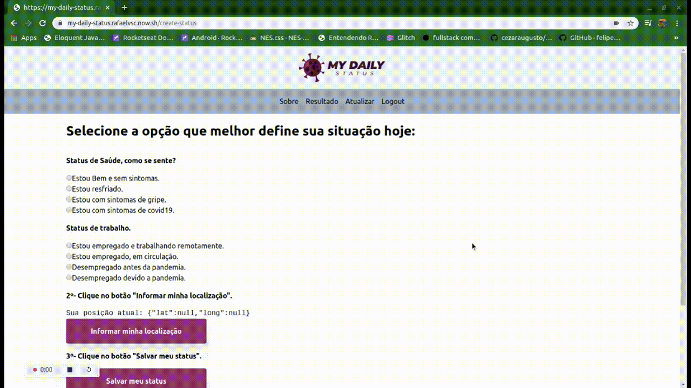

<h1 align="center">
    
</h1>

<h4 align="center">
  🚀 Fullstack Lab
</h4>
<p align="center">
  

  
  
  <a href="https://github.com/RafaelVsc/my-daily-status/commits/master">
    
  </a>

  <a href="https://github.com/RafaelVsc/my-daily-status/issues">
    
  </a>

  
</p>

<p align="center">
<a href="#-projeto">Projeto</a>&nbsp;&nbsp;&nbsp;|&nbsp;&nbsp;&nbsp;
  <a href="#battery-tecnologias">Tecnologias</a>&nbsp;&nbsp;&nbsp;|&nbsp;&nbsp;&nbsp;  
  <a href="#-layout">Layout</a>&nbsp;&nbsp;&nbsp;|&nbsp;&nbsp;&nbsp;
  <a href="#zap-executando">Executando</a>&nbsp;&nbsp;&nbsp;|&nbsp;&nbsp;&nbsp;
  <a href="#memo-licença">Licença</a>
</p>

<br>

## 💻 Projeto
Esse projeto foi desenvolvido durante o programa FullStackLab do [Devpleno](https://devpleno.com/)

My daily status é uma aplicação onde você pode realizar um registro diário do seu estado de saúde e situação de trabalho durante a pandemia de corona vírus (COVID-19), além de mostrar o registro (de forma anonima) de outros usuários baseados em sua localização.
Para acessar a aplicação 👉 [aqui](https://my-daily-status.rafaelvsc.now.sh/)

## 🔋 Tecnologias

Esse projeto foi desenvolvido com as seguintes tecnologias:

- [Next.js](https://nextjs.org/)
- [React](https://reactjs.org)
- [Auth0](https://auth0.com/)
- [Firebase](https://firebase.google.com/?hl=pt-br)
- [Zeit](https://zeit.co/)
- [Tailwind CSS](https://tailwindcss.com/)

## 🎨 Layout



## ⚡ Executando

1 - Em um terminal, entrar na raiz do projeto **/my-daily-status** e rodar o comando:

```
$ npm install
ou
$ yarn install
```

2 - Ainda na raiz do projeto, rodar o comando:

```
$ npm run dev
ou
$ yarn dev
```

Feito isso, acessar o endereço http://localhost:3000

Se desejar, pode fazer o build do projeto, usando o seguinte comando:

```
$ npm run build
ou
$ yarn build
```

## 📝 Licença

Esse projeto está sob a licença MIT. Veja o arquivo [LICENSE](LICENSE.md) para mais detalhes.

---

Feito com horas em frente ao 👨‍💻 por [Rafael Vescio](https://www.linkedin.com/in/rafael-vescio/)